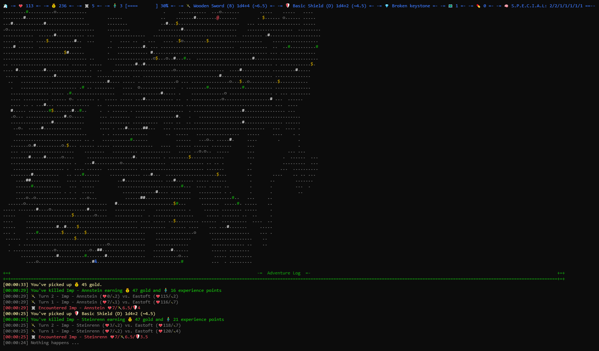

# php-roguelike

[](https://www.codefactor.io/repository/github/sebastianluczak/php-roguelike)           [](https://github.com/sebastianluczak/php-roguelike/actions/workflows/docker-image.yml)


## What is this?

[PHP Roguelike](https://github.com/sebastianluczak/php-roguelike) is a console (CLI) based game driven by rogulike scheme based progression.
You'll die. A lot. Embrace it and go further and further, discovering new bosses and trying to beat high score.

This game is done as a part of side-project to show'up some programming skills in PHP. You're welcome to give ideas and put some PR's.

## Trivia

> J: Mom, can we have ADOM at home?
>
> M: But we have ADOM at home...
>
> Meanwhile, ADOM at home:



## Purpose

It's so fun to fiddle with some side-project and have a time sink for myself. I was missing side project and playground/testing area to experiment and keep on track with everything.
I'll produce a roadmap in some time to see some final goal and keep myself motivated.

## Influences

Ok, so in fact I've gathered a few ideas from different games. Most notably you'll see elements from:
- Dungeons and Dragons
- Fallout
- ADOM
- Enter the Gungeon

## Run & build

#### Prerequisites:
- Docker with Docker Compose
- Terminal Emulator capable of displaying rich text and XTERM256 support

```shell
cd ~
git clone https://github.com/sebastianluczak/php-roguelike.git
cd php-roguelike
chmod +x bin/*
bin/build.sh
```

## Keymap

See: [Keymap](https://github.com/sebastianluczak/php-roguelike/blob/feature/cities-dlc/src/Enum/Game/KeyboardMapEnum.php)
```shell
W/A/S/D - Movement of character
I - Player Interface (WIP)
L - show Leaderbords
Q - quits the game
H - use Healing Potion

-- 
DEV_MODE
R - regenerates the level
P - switches DevMode (required for some output and commands)
R - regenerate a map (DEV_MODE required) 
M - DevRoom :D (╯°□°)╯︵ ┻━┻ 
G - God Mode!
K - Increase MapLevel
```

## Win/Lose conditions

As all roguelikes - you'll die eventually. It's just part of the process. Your score will be written down in LeaderBoards. Try to achieve best score!

## Legend

There are multiple tiles with scattered logic all around the board.

```shell
# - Chest or RareChest - guaranteed drop of Item, Gold or Health Potion
$ - Mysterious Man - can do good things for you
* - Boss Fight - be prepared!
o - Altar, drop some gold for a buff or curse
```
Go figure the rest by yourself, see [here](https://github.com/sebastianluczak/php-roguelike/tree/feature/cities-dlc/src/Model/Tile) to get started. No documentation folks :).

## Win strategy
1. Go for Luck > 1
2. Hoard Chests for life
3. Try to stay alive (visit ShopTile and AltarTile as often as you can)
4. Fight small creatures (luck based)
5. Visit Chests
6. Go for max Health Regen from buffs
7. (wait for it, wander around)
8. Fight BOSS
9. Die and repeat
10. PROFIT

## API

> WHAT THE HECK?! RPG cli game in PHP with API?!

Visit [127.0.0.1/api](https://127.0.0.1/api) and check and check out some neat features we're planning, like:
- complete access to current state of the game being played via API
- custom, high risk - high reward type one hit dungeons/mazes
- NPC Dialogue API and CreatureProvider moved to microservice

My plan is to be able to change/update/set state of player dynamically via API.
I know I'm far from it because logic is inside loop of the game but ...